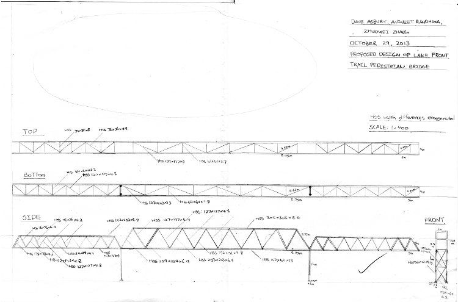

In CIV102, our group was tasked with building a truss bridge across a 150-metre valley. During the project, I produced the design drawing, and helped with some of the calculations.

Drawing showing the final design of our bridge - three Warren truss spans, 40, 70, and 40 metres long, respectively.

[Scan of our final presentation materials](https://drive.google.com/folderview?id=0B-fqnmBSesbtVV9naU1xWEFZQUk&usp=sharing)

Our group explained the rationale of our design decisions in our [design report](https://docs.google.com/file/d/0B-fqnmBSesbtOTRYd0FVQWhKSDQ/edit).
