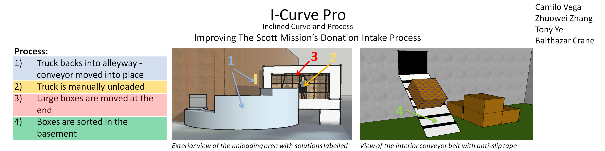
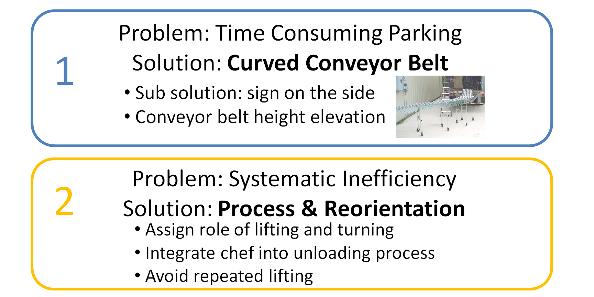
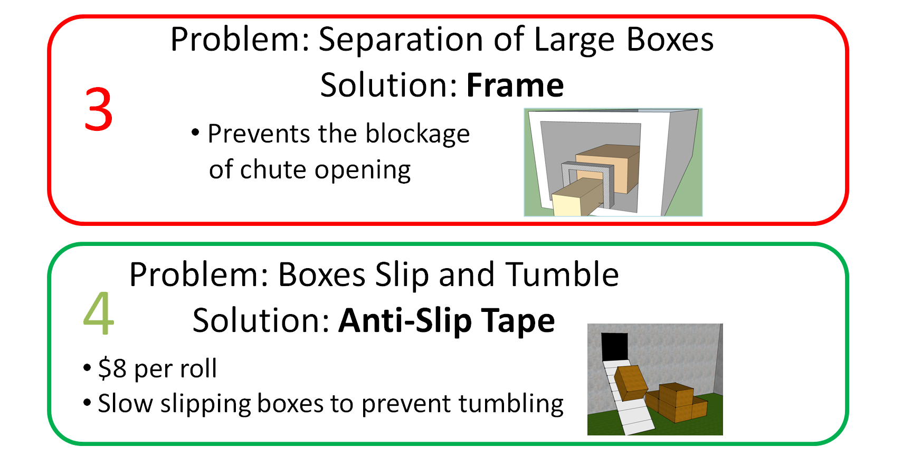

For the Praxis II concept design, our team, consisting of [Bathazar](http://cranebalthazar.wix.com/designportfolio), [Camilo](https://sites.google.com/site/juancamilovegadesignportfolio/site-map), [Tony](http://tonyyezj.wix.com/portfolio), and me, developed four solutions to speed up the unloading of donations at the Scott Mission. 

We approached the problem by breaking down the unloading process into parts. We then examined each part separately, choosing solutions that would solve bottlenecks in each stage, and would work well with the other chosen solutions, yet can stand on their own in case the full solution is not implemented. We also aimed to take advantage of off-the-shelf components because of our focus on practicality. 

Using functional decomposition, we identified the following stages from the RFP's description:

1. truck drives and parks to line up with door
2. One person gets into the truck, sets up ramp to go down chute
3. Person repeatedly lift item to ramp, taking care not to spill items
4. Chef chooses item that he/she takes
5. Items that are not chosen go down the ramp

So for each part, we thought of potential ways to increase efficiency, and for each idea, we researched reference designs for preexisting components that can be adapted. Finally, we evaluated and tested our candidate concepts, and converged to four solutions that can be implemented separately or as a whole:

1. Curved conveyor belt to allow the truck to simply back into the alleyway instead of having to maneuver in the tight parking lot to line up with the door
2. A new lifting procedure that splits the work evenly between 3 workers in the truck
3. A gate to identify large packages before they are able to jam the intake window
4. Anti-slip tape for the interiour conveyor belt to prevent slipping and tumbling of boxes

For more information, see our poster below:

