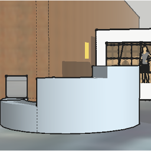
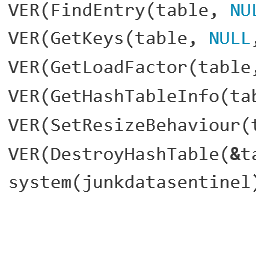
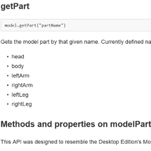
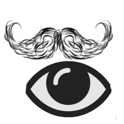
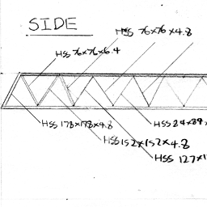
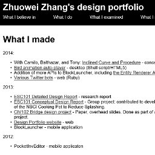

2014:

 - With Camilo, Balthazar, and Tony: [Inclined Curve and Procedure](esc102/cdr.html) - concept design
   

 - [Bird animation auto-player](bird_anim.html) - desktop (Shell script/HTML5)
   

 - Addition of more APIs to BlockLauncher, including [the Entity Renderer API](bl_renderer_api.html) - mobile (JavaScript)
   

 - [Various Twitter bots](twitterbots.html) - web (Ruby)
   

2013:

 - [ESC101 Detailed Design Report](esc101/ddr.html) - research report
 - [ESC101 Conceptual Design Report](esc101/cdr.html) - Group project: contributed to development of the NSCI Cooking Pot to Reduce Splashing.
 - [CIV102 Bridge design project](bridge.html) - Paper, overhead slides. Done as part of a group project.
   

 - [Design Portfolio website](portfolio.html) - web
   

 - BlockLauncher - mobile application

2012:

 - PocketInvEditor - mobile applicaton
